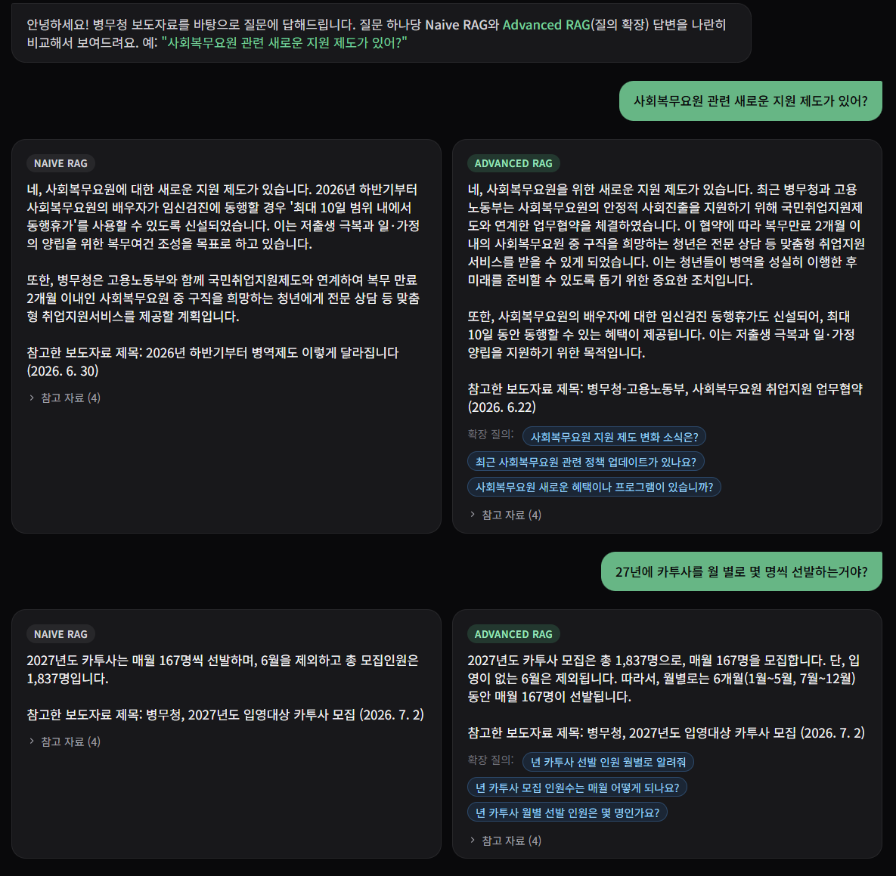
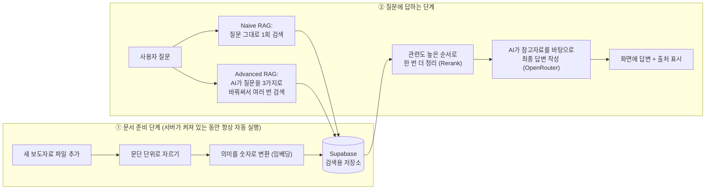

# 병무청 보도자료 Q&A 챗봇



병무청이 배포한 보도자료를 학습해서, 사람이 질문하면 그 내용을 근거로 답해주는 AI 챗봇 웹 서비스입니다.
같은 질문에 대해 "기본 검색 방식"과 "향상된 검색 방식"이 만든 답변을 나란히 비교해서 보여주는 것이 특징입니다.

---

## 1. 전체 개요

이 서비스는 병무청 보도자료 문서(10건, 계속 추가 가능)를 미리 읽어서 이해해두고, 사용자가 궁금한 것을
물어보면 관련된 보도자료 내용을 찾아서 그 내용을 바탕으로 답을 만들어주는 챗봇입니다.

일반적인 AI 챗봇과 다른 점은, AI가 알고 있는 대로 아무렇게나 대답하는 게 아니라 **"실제 보도자료 원문을
먼저 찾아본 뒤, 그 내용에 근거해서만" 답변**한다는 것입니다. 그래서 답변 아래에는 항상 "이 답변은 어떤
보도자료의 어느 부분을 참고했는지"가 함께 표시됩니다. 이런 방식을 기술적으로 **RAG(Retrieval-Augmented
Generation, 검색 증강 생성)**라고 부릅니다. "검색해서 찾은 자료를 근거로 답변을 생성한다"는 뜻이며,
이 문서 전체에서 반복해서 등장하는 핵심 개념입니다.

또한 이 서비스는 하나의 질문에 대해 두 가지 검색 방식으로 각각 답변을 만들어 **동시에 비교**해서 보여줍니다.

- **Naive RAG (기본 검색)**: 질문을 있는 그대로 한 번만 검색합니다.
- **Advanced RAG (향상된 검색)**: 질문을 AI가 여러 다른 표현으로 바꿔가며 여러 번 검색한 뒤, 찾은 결과를
  모두 모아서 더 폭넓게 검토합니다. 사람이 질문할 때 못 쓴 단어나 표현이 있어도 놓치지 않기 위한 방식입니다.

두 방식 중 어느 쪽이 더 정확하고 풍부한 답을 주는지 눈으로 직접 비교할 수 있습니다.

---

## 2. 웹 서비스 사용 방법

### 2-1. 준비물 (계정/키 발급)

이 서비스는 아래 4개의 외부 서비스를 사용하며, 각 서비스에서 발급받은 "API 키"(일종의 출입증 같은 비밀
문자열)가 필요합니다. 모두 무료 또는 소액 과금으로 테스트해볼 수 있습니다.

| 서비스 | 역할 | 발급처 |
|---|---|---|
| Supabase | 문서 내용을 검색 가능한 형태로 저장해두는 저장소 (벡터 데이터베이스) | https://supabase.com |
| OpenAI | 문서와 질문을 "의미 기반으로 비교 가능한 숫자"로 변환 (임베딩) | https://platform.openai.com |
| OpenRouter | 최종 답변 문장을 생성하는 AI 채팅 모델 연동 | https://openrouter.ai |
| Cohere | 검색된 후보 중 진짜 관련 있는 것만 골라내는 재정렬(Rerank) | https://dashboard.cohere.com |

### 2-2. 로컬에서 실행하는 방법

```bash
# 1) 저장소 내려받기
git clone https://github.com/GitBravo/7th_repo.git
cd 7th_repo

# 2) 필요한 패키지 설치 (Python 3.10 이상 권장)
pip install -r requirements.txt

# 3) 키 설정 - .env.example을 복사해서 .env를 만들고, 발급받은 키를 채워넣기
cp .env.example .env

# 4) 데이터베이스 준비 - sql/setup_supabase.sql 내용을
#    Supabase 프로젝트의 SQL Editor에 붙여넣고 한 번 실행 (최초 1회만)

# 5) 보도자료 문서를 검색 가능한 형태로 변환해 데이터베이스에 적재
python chunk_documents.py
python embed_and_upload.py

# 6) 서버 실행
uvicorn backend:app --reload
```

서버가 뜨면 브라우저에서 `http://localhost:8000` 으로 접속하면 됩니다.
`documents` 폴더에 새 보도자료 파일(.hwpx)을 넣으면, 서버가 켜져 있는 동안 자동으로 읽어서 반영합니다
(사람이 5번 단계를 다시 실행할 필요 없음).

### 2-3. 배포 방법 (다른 사람도 접속할 수 있게 인터넷에 올리기)

이 서비스는 파이썬으로 만든 하나의 서버 프로그램(`backend.py`)이기 때문에, 파이썬 서버를 띄울 수 있는
호스팅 서비스(Render, Railway, Fly.io, 또는 회사 자체 서버 등) 어디에나 올릴 수 있습니다. 공통적으로
필요한 절차는 다음과 같습니다.

1. 위 "준비물"의 API 키 4종류를 배포 환경의 환경 변수(Environment Variables)로 등록 (`.env` 파일 내용과 동일)
2. `pip install -r requirements.txt` 로 패키지 설치되도록 설정
3. 서버 시작 명령어로 `uvicorn backend:app --host 0.0.0.0 --port <포트번호>` 지정
4. (선택) 도메인을 연결하면 `내주소.com` 같은 형태로 접속 가능

현재 저장소는 로컬 실행을 기준으로 정리되어 있으며, 위 절차만 추가하면 대부분의 클라우드 호스팅 서비스에
그대로 올릴 수 있는 구조입니다.

---

## 3. 핵심 기능

- **문서 기반 정확한 답변 (RAG)**: 보도자료 원문에 없는 내용은 "모른다"고 답하며, 근거가 된 보도자료
  제목·날짜·문단을 답변과 함께 보여줍니다. AI가 그럴듯하게 지어내는 것을 방지합니다.
- **Naive RAG vs Advanced RAG 답변 비교**: 질문 하나에 대해 두 가지 검색 방식의 답변을 동시에 보여줘서,
  검색 방식에 따라 답변 품질이 어떻게 달라지는지 비교할 수 있습니다. Advanced RAG는 실제로 어떤 검색어들을
  추가로 사용했는지도 함께 보여줍니다.
- **새 문서 실시간 자동 반영**: `documents` 폴더에 새로운 보도자료 파일을 넣기만 하면, 별도 작업 없이
  서버가 자동으로 감지해서 몇 초 안에 학습(임베딩 및 저장)까지 끝냅니다.
- **대화 이력 저장 및 이어가기**: 좌측 사이드바에 지난 대화들이 자동으로 남고, 클릭하면 그 대화를 그대로
  다시 볼 수 있습니다. 우측 상단의 `+` 버튼으로 새 대화를 언제든 시작할 수 있습니다. (대화 기록은 사용 중인
  브라우저에만 저장됩니다.)
- **어디서나 보기 좋은 화면**: PC와 휴대폰 화면 크기에 맞춰 자동으로 레이아웃이 바뀌는 반응형 디자인입니다.

---

## 4. 주요 파일 및 폴더 구조

```
7th_repo/
├── documents/                  # 학습 대상 보도자료 원본 파일(.hwpx)을 모아두는 폴더
├── static/                     # 웹 화면(사용자가 실제로 보는 채팅 화면) 관련 파일
│   ├── index.html              #   화면 골격 (레이아웃, 디자인)
│   └── app.js                  #   화면 동작 코드 (채팅 전송, 대화 이력 관리 등)
│
├── backend.py                  # 웹 서버의 시작점. 화면을 보여주고, 질문이 오면 답변을 만들어 돌려줌
├── rag_pipeline.py             # "질문 → 관련 문서 검색 → 답변 생성" 핵심 두뇌 로직 (Naive/Advanced 둘 다)
│
├── hwpx_chunker.py             # 보도자료 원문을 읽기 좋은 단위(문단/항목)로 잘라내는 로직
├── supabase_loader.py          # 잘라낸 문단을 숫자로 변환해 데이터베이스에 저장하는 로직
├── watch_documents.py          # documents 폴더를 실시간 감시해 새 파일을 자동으로 처리하는 로직
│
├── chunk_documents.py          # (수동 실행용) 문서 전체를 한 번에 문단 단위로 잘라내는 스크립트
├── embed_and_upload.py         # (수동 실행용) 잘라낸 문단 전체를 한 번에 데이터베이스에 저장하는 스크립트
│
├── sql/setup_supabase.sql      # 데이터베이스에 필요한 저장 공간(테이블)을 만드는 준비 스크립트 (최초 1회 실행)
├── requirements.txt            # 이 서비스를 실행하는 데 필요한 파이썬 패키지 목록
├── .env.example                # API 키를 입력하는 설정 파일의 견본 (실제 키는 .env 파일에 별도 보관)
│
├── CLAUDE.md                   # 이 프로젝트를 만들 때 사용한 개발 지침/요구사항 문서
└── PLAN.md                     # 개발 과정에서 내린 주요 결정과 그 이유를 정리한 기록
```

> 참고: `chunk_documents.py`/`embed_and_upload.py`(수동 일괄 처리용)와 `watch_documents.py`(자동 실시간
> 처리용)는 문서를 "잘라내고 저장하는" 같은 로직을 공유하도록 `hwpx_chunker.py`, `supabase_loader.py`로
> 분리해두었습니다. 서버가 켜져 있을 때는 `watch_documents.py`가 자동으로 동작하기 때문에, 평소에는
> 앞의 두 스크립트를 직접 실행할 일이 거의 없습니다 (최초 세팅 시에만 사용).

---

## 5. 아키텍처

전체 흐름을 아주 쉽게 요약하면 다음과 같습니다.

> **[준비 단계]** 보도자료 원문을 읽기 좋은 크기로 잘라서, "의미가 비슷한 문장은 가깝게" 배치되도록
> 숫자로 변환(임베딩)한 뒤 데이터베이스에 저장해둔다.
> **[질문 단계]** 사용자가 질문하면, 질문도 같은 방식으로 숫자로 변환해서 데이터베이스에서 "의미가 가장
> 비슷한" 문단들을 찾아온다. 그중 진짜 관련 있는 것만 한 번 더 골라낸 뒤, 그 내용을 AI에게 "이 내용을
> 참고해서 답해줘"라고 건네주면 AI가 최종 답변을 완성한다.



조금 더 기술적으로 풀어서 설명하면 아래와 같습니다 (몰라도 서비스 사용에는 지장 없습니다).

1. **문서 변환(hwpx → 텍스트)**: 병무청 보도자료는 `.hwpx`(한글 워드프로세서) 형식이라, 이를 프로그램이
   읽을 수 있는 순수 텍스트로 먼저 변환합니다.
2. **청킹(Chunking)**: 변환된 텍스트를 통째로 다루면 검색 정확도가 떨어지기 때문에, 보도자료의 "1번 항목,
   2번 항목"처럼 의미 단위(문단/조항)로 잘게 나눕니다. 이렇게 나눈 조각을 "청크(chunk)"라고 부릅니다.
3. **임베딩(Embedding)**: 각 청크를 OpenAI 모델을 이용해 숫자 배열(벡터)로 변환합니다. 의미가 비슷한
   문장일수록 숫자 배열도 비슷해지기 때문에, "비슷한 의미의 문장 찾기"가 계산으로 가능해집니다.
4. **벡터 데이터베이스 저장(Supabase)**: 변환된 숫자 배열과 원문을 Supabase(pgvector 확장 기능을 사용하는
   데이터베이스)에 저장해둡니다.
5. **검색(Retrieval)**: 사용자가 질문하면 질문도 같은 방식으로 숫자로 변환한 뒤, 저장해둔 청크 중 가장
   비슷한 것들을 찾아옵니다. Advanced RAG는 이 단계에서 질문을 3가지 다른 표현으로 확장해 더 폭넓게
   검색합니다(Multi-Query Expansion).
6. **재정렬(Rerank)**: 1차로 찾아온 후보들을 Cohere의 재정렬 모델이 "질문과 실제로 얼마나 관련 있는지"
   기준으로 다시 채점해서, 가장 관련도 높은 4개만 추려냅니다.
7. **답변 생성(Generation)**: 추려낸 청크 내용을 AI 채팅 모델(OpenRouter를 통해 연결)에게 전달하고,
   "이 내용에 근거해서만 답하라"고 지시해 최종 답변을 만듭니다.
8. **실시간 자동 반영**: `documents` 폴더를 실시간으로 감시하는 프로그램이 항상 백그라운드에서 켜져
   있어서, 새 파일이 들어오면 1~4번 과정을 자동으로 실행해 즉시 검색 대상에 포함시킵니다.

사용한 기술을 한 줄로 정리하면: **FastAPI(웹 서버) + Tailwind CSS(화면 디자인) + Supabase/pgvector(검색용
저장소) + OpenAI(임베딩) + OpenRouter(답변 생성 AI) + Cohere(재정렬)** 조합입니다.

---

## 6. Git 저장소 주소

https://github.com/GitBravo/7th_repo
